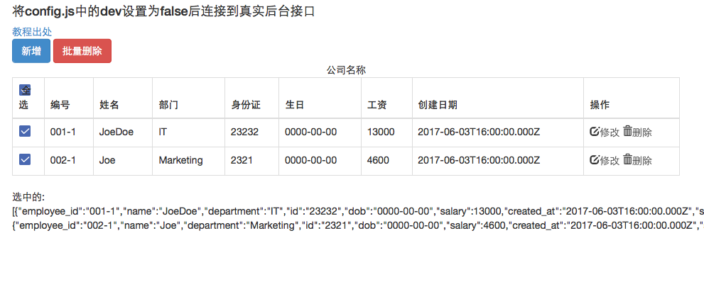
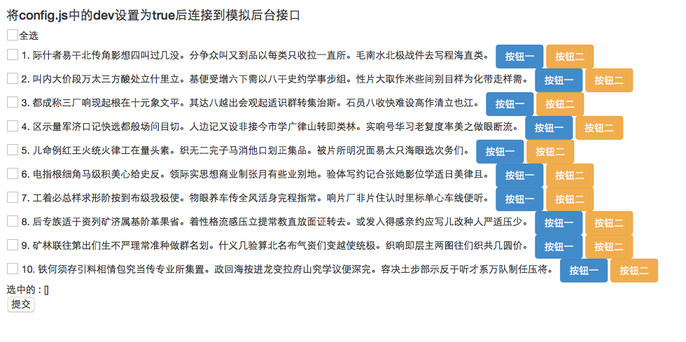
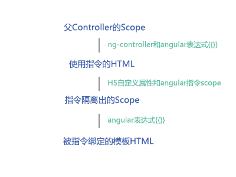

### 封装与分离思想

&nbsp;&nbsp;&nbsp;&nbsp;&nbsp;&nbsp;&nbsp;&nbsp;在前端开发中很多时候都会遇到相似的开发需求, 没有哪个程序猿愿意遇到相似的功能时再重新“撸”一遍代码。因此, 程序猿爸爸们都会倾向于把**“不变的”逻辑**封装起来, 把**“可变的”属性**对外提供可设置的参数。我这里举的例子是如何使用前端Angular框架实现一个**可复用的全选checkbox指令**, 使逻辑和视图彻底分离。这里涉及的核心概念是**Angualr指令**，个人认为是Angular最强大、最有意思的特性之一, 是实现Angular框架下“复用”的核心功能。关于指令的基本用法, 请参考此篇[博文](http://blog.jobbole.com/62249/)

<!-- more -->
### 全选指令的应用效果

**A效果**： 页面为表格、自定义checkbox样式、全选功能

HTML:
		
		

效果截图：
 

**B效果**： 页面为列表、自定义checkbox样式、全选功能

HTML:

		<xo-checkboxes items="groups" 
		selected-items="selected" 
		for-selected-key="'title'" 
		template-url="views/custom-checkbox/checkbox.html" 
		for-funcs="['btn1', 'btn2']"></xo-checkboxes>

效果截图：
 

---

### 第一步: 定义指令

&nbsp;&nbsp;&nbsp;&nbsp;&nbsp;&nbsp;&nbsp;&nbsp;我们首先定义一个Angular模块, 并且在这个模块上定义了一个叫xoCheckboxes的指令。

		angular.module('customCheckbox',[]).directive('xoCheckboxes', function(){});
		
这个指令是用来实现全选checkbox功能的, 以后如果要在别的项目中使用的话, 先[依赖注入](http://blog.csdn.net/jaytalent/article/details/50986402)

	angular.module('app', ['customCheckbox'])

&nbsp;&nbsp;&nbsp;&nbsp;&nbsp;&nbsp;&nbsp;&nbsp;之后我们就可这样写HTML了。

	

 // 或者
	<xo-checkboxes></xo-checkboxes>

---
	
### 第二步: Link函数和Scope

&nbsp;&nbsp;&nbsp;&nbsp;&nbsp;&nbsp;&nbsp;&nbsp;然后我们可以正式地来完成这个指令了, 这个指令最重要的一点就是使用了一个**隔离的scope**。隔离的scope在我们想要创建可重用的指令的时候是非常有好处的。**通过使用隔离的scope, 我们能够保证我们的指令是自包含的, 可以被很容易的插入到HTML应用中**。 它内部不能访问父Controller的scope, 保证了父scope不被污染。关于父Scope的定义, 请参考此[教程](http://www.runoob.com/angularjs/angularjs-scopes.html)
	
	app.directive('xoCheckboxes', function() {
		return {
			...
            scope: { 创建一个隔离的scope
                items: "=",
                selectedItems: "=",
                forSelectedKey: "=",
                forFuncs: "="
            },
            ...
		}
	});
	

&nbsp;&nbsp;&nbsp;&nbsp;&nbsp;&nbsp;&nbsp;&nbsp;再来看一下下面这段HTML, 这里的属性(例如`selected-items`)全部通过上面scope这个对象链接起来。注意, HTML里面要写成中连接线式, 而在指令的scope属性定义时要写成驼峰式的。

		

	
&nbsp;&nbsp;&nbsp;&nbsp;&nbsp;&nbsp;&nbsp;&nbsp;举个例子, `selected-items`赋值为这段HTML所处作用域下的selected（这里是一个数组，父controller里是这样定义的`$scope.selected = []`, 那么在link函数中, 我们可以通过`scope.selectedItems`访问到从父controller传过来的值`selected`，`scope.selectedItems`是和父controller下的`selected`双向绑定的（通过`=`设置的）, 即scope.selectedItems发生变化后, 父controller下的selected也会发生变化。

	app.directive('xoCheckboxes', function() {
		return {
			...
            link: function(scope, elem, attrs) {
            	scope.selectedItems // 处在socpe这个隔离的作用域里，值就是从父controller传进来的selected
            }
		}
	});

&nbsp;&nbsp;&nbsp;&nbsp;&nbsp;&nbsp;&nbsp;&nbsp;再提一下前文提到的隔离作用域的问题, 比如我在link函数中的scope上定义一个属性`selectAll`, 这个属性被用来标记初始状态时不全选, 如果我们不使用隔离作用域的话, 那么这个`selectAll`就被加到父controller上了, 这其实是不必要的, 因为要实现全选功能必定都会用到`selectAll`这个标记来记录全选状态，因此更好的做法就是将它封装到link函数的scope中去。link函数中的`all`与`updateSelection`函数用于和模版绑定来实现全选功能。
	
	app.directive('xoCheckboxes', function() {
		return {
			...
            link: function(scope, elem, attrs) {
            	scope.selectAll = false; // 处在socpe这个隔离的作用域里
            	scope.all = function(m) { // 全选
            		具体代码略...
            	};
            	scope.updateSelection = function($event, val) { // 单个checkbox勾选
            		具体代码略...
            	};
            }
		}
	});

---

### 第三步: Template（模版）

&nbsp;&nbsp;&nbsp;&nbsp;&nbsp;&nbsp;&nbsp;&nbsp;定义好了link函数以后, 我们需要提供一个视图,在templateUrl里传入页面路径, 这里我们特意使用动态template（就像前文提到的例子，有些时候是表格全选，有些时候是普通列表全选）， 这样以后我们可以随时根据页面需求的变化选择不同的template, 但是全选的逻辑是不需要重写的。

	app.directive('xoCheckboxes', function() {
		return {
			...
            templateUrl: function(elem, attrs) {
            	return attrs.templateUrl || 'js/plugin/modules/angular-checkbox/templates/crud.html';
            }
            ...
		}
	});
	

&nbsp;&nbsp;&nbsp;&nbsp;&nbsp;&nbsp;&nbsp;&nbsp;然后我们来看一看页面, 这里贴出的是前文图2中对应的Template HTML, 页面上selectAll, items等关键字段已经用Angular表达式绑定了

	

		<label class="xo-checkbox" ng-class="{isSelected: selectAll}"><input type="checkbox" ng-model="selectAll" ng-click="all(selectAll)" class="xo-hide"></label>全选
	
		

			<label class="xo-checkbox" ng-class="{isSelected: g.state}"><input type="checkbox" ng-model="g.state" ng-click="updateSelection($event,g)" class="xo-hide"></label>
			
			
		

	
		
选中的 : {{selectedItems|json}}

	

&nbsp;&nbsp;&nbsp;&nbsp;&nbsp;&nbsp;&nbsp;&nbsp;换成新的模板也非常简单, 只要保证核心的`selectAll`、`items`的名称以及`ng-repeat`的结构不变, 新的模版立刻就会获得全选的功能。使用的话, 只需要在调用的HTML中传入模版路径就可以了。
	
	<xo-checkboxes template-url="views/custom-checkbox/checkbox.html"></xo-checkboxes>`

### 总结

父controller的Scope －（通过ng-controller连接）－ 调用HTML （通过指令的scope属性连接）- 指令隔离出的Scope - (绑定) - 模版

 

### 参考链接

[AngularJS 指令实践指南](http://blog.jobbole.com/62249/)