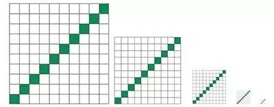
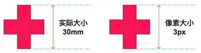
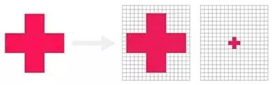
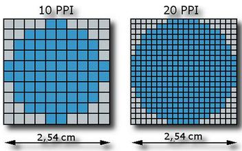
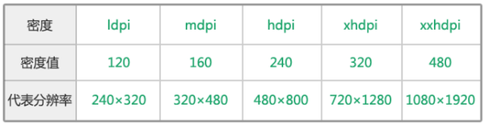
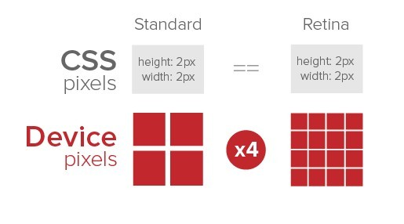

设计师Aimy：“嗨，Tom，我把设计定稿发给你了，标注的清清楚楚的，接下来看你的了。”
前端工程师Tom： “没有问题，一个下午就搞定了，check it out～”

于是乎，Tom打开了Aimy的设计稿。。。然后。。。

前端工程师Tom：“Aimy啊，你给的设计稿上怎么宽度标的是750像素的，iphone 6的像素不是375像素的嘛！？”
设计师Aimy：“怎么可能？iphone 6的参数表上写的很清楚嘛，750X1334。”

这是怎么回事呢？其实他们所说的**[像素]**不是指的同一个概念。Aimy说的是**设备像素**，而Tom认为的像素其实是**逻辑像素**。

<!-- more -->
### 设备像素

假设我们现在有5种屏幕。现在，我们对它们各自的显像单元说：“嘿，请绘制**10个像素**的绿色斜线”。好的，屏幕上的各个显像单元接收到电子信号后，发出绿光，完成了它们各自的工作。那么让我们来看看它们产出的成果。

 

我们观察到的结果是：

+ 在各个屏幕的81个方块中，每个屏幕都有10个方块的绿色显示出来;
+ 每一条斜线的真实大小（就是我们所熟知的“长度”）完全不一样（最左边的斜线最长，最右边的斜线几乎快看不清了）;

现在我们知道了，虽然各个屏幕收到的指令都是一样的，但是最终的显示结果是有巨大的差异的。原因参见第3节。

简单总结一下：

+ 设备像素涉及的是物理概念。
+ 像素是一个数量单位，而非长度单位。它用来描述屏幕上显像单元的数量。我们平时所说的**屏幕分辨率640X960**，应该理解为屏幕横向有640个显像单元，纵向有960个显像单元。
+ 虽然像素是数量单位，但它也是有大小的。参见下一节。

### 逻辑像素

上面1节我们接触到的其实是**实际像素(或者称设备像素)**，无论是**分辨率还是像素密度**都是设备出厂后就决定的属性。这一节我们引入**逻辑像素或称设备独立像素(在Web编程里就是css像素)**这一重要概念, 逻辑像素和实际工作的设计与开发息息相关。

现在我们需要将下图这个红十字显示到一个屏幕上去, 我们规定它的大小是30mm或者3px

 

这时会产生两种显示方案，一种是在屏幕上显示实际大小30mm或者显示原来的像素大小3px（按逻辑像素显示）：

 

这里后者已经将红十字缩小了数倍来维持3个像素的定义，但很明显这种效果与我们的认知相悖，如果屏幕像素密度再增大几个数量级，那么这个红十字将消失在我们的视线中。

所以，为了良好的显示这个红十字的大小，**这个屏幕会将5个设备像素当做1个逻辑像素使用来还原显示这个红十字**，在这里我们可以看到红十字显示的实际像素是15px，而逻辑像素是：3px。换言之，我们在css代码里写下`.line { width: 3px; height: 3px; }`，浏览器取得的是逻辑像素，然后设备屏幕需要将逻辑像素转化成设备像素最终显示在屏幕上。我们会在后面详细说明设备像素和逻辑像素之间的换算是如何产生的。

总结一下：

+ 逻辑像素涉及的是Web编程的概念。
+ 设置同样的逻辑像素，在不同分辨率的屏幕中呈现的物理尺寸是相同的，但所占用的设备像素是不同的。
+ CSS规范中，有绝对单位和相对单位2种，`px`是一个相对单位，**描述的是逻辑像素，对应的是设备像素**。
+ 实际像素和逻辑像素之间是存在对应关系的。参见第4节。

### 像素密度(DPI)

像素密度(DPI)描述的是每英寸的像素点数, 单位一般是像素/英寸。
计算公式如下：

> DPI ＝ 根号(设备宽度像素)²+(设备高度像素)²/设备屏幕对角线长度

 

从上图，我们可以知道，

+ 如果像素密度是10px/inch的话,也就是每英寸里有10个像素,每像素的大小就是1/10英寸; 如果像素密度是20dpi的话,那每像素的大小就是1/20英寸了。
+ 同样显示一个圆形，**像素密度越大，图像的清晰度越高**。
+ 多余的像素只是用以更清晰地显示图像，而非显示更多内容，物理尺寸仍然是一样的，就像前面提到的那个红十字，无论在哪个屏幕上显示，它的物理尺寸都是30mm。

有了这些，我们就可以计算各种分辨率屏幕的像素密度，计算的例子就不写了，附上主流设备的DPI参数 [传送门](http://dpi.lv/)

有了大量的DPI参数以后，我们就大致得到了密度分界

 	

DPI在120-160之间的手机被归为低密度手机，160-240被归为中密度，240-320被归为高密度，320－480被归为超高密度，480以上就是超超高密度了。

简单总结一下：

+ 一个像素的大小是由**像素密度**决定的。
+ 成像清晰度的关键参数是**DPI**(当然还有别的因素，比如人眼的观察距离等)。典型例子有iphone 3g的屏幕分辨率是320X480, iphone 4的屏幕分辨率翻了一倍为640X960，虽然iphone 4的设备尺寸没有改变，还是3.5英寸，但是由于iphone 4将像素密度提高了一倍，因此清晰度自然翻了一倍。

### 设备像素比(dppx/dpr)

通过上一节最后得到的密度分界，iphone和安卓的设备商就定义了设备的默认缩放比例，即“设备像素比”。设备像素比是沟通逻辑像素和实际像素之间的桥梁。dpr和dppx，缩放因子（scale）指的都是这个概念。

首先说iPhone，iPhone屏幕的dpr都是整数值，在iphone 6 plus出现之前，iphone的dpr始终是2（设备像素/逻辑像素＝2），即使是iphone 6 plus出现了，iphone到底其实也就只有2，2.87这两个dpr。

而安卓的dpr值，并不像iphone那样就只有两个值。安卓的dpr是千奇百怪的，可能是1.5，2，3，4，2.5等等的都有。

我们可以以下面这个比例式作为一个参考

> low:medium:high:extra-high:extra-extra-high=0.75:1:1.5:2:3

 

用上图来直观地感受一下设备像素和逻辑像素之间的关系。当dpr为1时，使用1个设备像素显示1个逻辑像素。当dpr为2时，使用4个设备像素显示1个逻辑像素（如上图），当dpr比率为3时，使用9（3*3）个设备像素显示1个逻辑像素。

